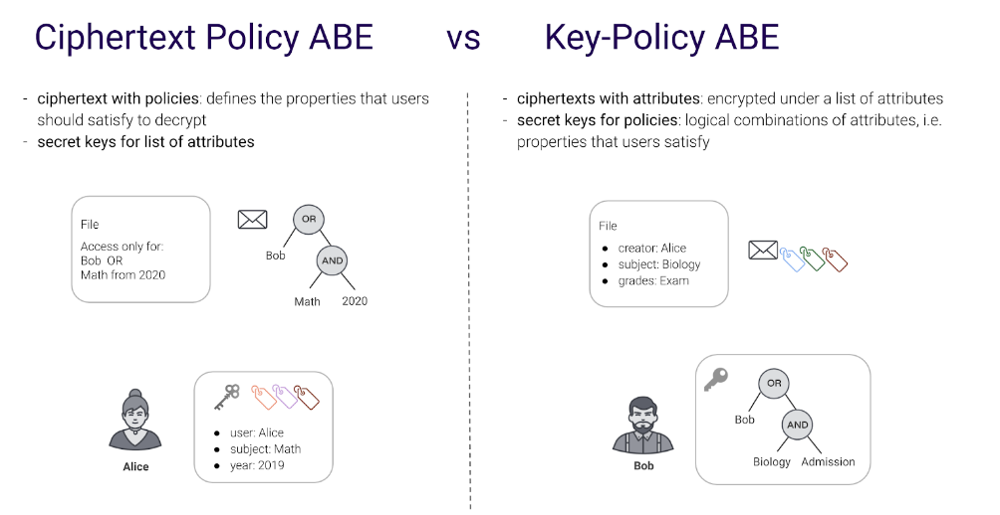

# abe_gpsw &emsp; [![Build Status]][actions] [![Latest Version]][crates.io]

This crate provides a Key-Policy Attribute-Based Encryption implementation based on [Attribute-Based Encryption for Fine-Grained Access Control of Encrypted Data](https://eprint.iacr.org/2006/309.pdf) written by Vipul Goyal, Omkant Pandey, Amit Sahai, Brent Waters.

The implementation uses the [BLS12-381](https://crates.io/crates/cosmian_bls12_381) elliptic curve for pairing.

[Build Status]: https://img.shields.io/github/workflow/status/Cosmian/abe_gpsw/CI%20checks/main
[actions]: https://github.com/Cosmian/abe_gpsw/actions?query=branch%3Amain
[Latest Version]: https://img.shields.io/crates/v/abe_gpsw.svg
[crates.io]: https://crates.io/crates/abe_gpsw


- [Quick start](#quick-start)
- [Building and testing](#building-and-testing)
- [Introduction to this repository cryptography](#introduction-to-this-repository-cryptography)
- [Attribute-Based Encryption (ABE)](#attribute-based-encryption-abe)
  - [Ciphertext-Policy](#ciphertext-policy)
  - [Key-Policy](#key-policy)
  - [Policies](#policies)
- [BLS12-381: Pairing-friendly elliptic curve](#bls12-381-pairing-friendly-elliptic-curve)


# Quick start

See the [demo code](./src/core/demo.rs) which contains a complete usage of the API with detailed comments.

Run it as a test using

```bash
cargo test core::demo::abe -- --nocapture`
```

# Building and testing

The crate is separated in 2 main modules:

 - `core`: contains the cryptographic code for GPSW. The main entry point is the [engine](./src/core/engine.rs) which use is demonstrated in the [demo code](./src/core/demo.rs).
 - `interfaces`: contains interfaces useful for Cosmian matching those in [crypto_base](https://github.com/Cosmian/crypto_base) as well as a Foreign Function Interface (FFI) useful to integrate with other languages. In particular, the code in this module demonstrates the use of hybrid cryptography involving ABE and AES and exposes it as a FFI.

 To build the core only, run

 ```bash
 cargo build --release
 ```

 To build the Cosmian interfaces without FFI, pass the `interfaces` feature flag, i.e.
 ```bash
 cargo build --release --features interfaces
 ```

 To build everything, including the FFI, pass the `ffi` feature flag, or use `--all-features` i.e.
 ```bash
 cargo build --release --all-features
 ```

The latter will build a shared library and one can verify that the FFI symbols are present using (linux)
```bash
objdump -T  target/release/libabe_gpsw.so
```

The code contains numerous tests that you can run using

 ```bash
 cargo test --release --all-features
 ```


## Building the library for a different glibc

1. Pull a distribution with the appropriate glibc (here targeting 2.17)

    ```sh
    sudo docker pull centos:centos7.4.1708
    ```


2. Execute the shell, mounting the current directory to `/root/abe_gpsw` inside the docker

    ```sh
    sudo docker run -it --rm -v $(pwd):/root/abe_gpsw centos:centos7.4.1708 /bin/bash
    ```

3. Inside the docker container, install rustup

    ```sh
    curl --proto '=https' --tlsv1.2 -sSf https://sh.rustup.rs | sh
    ```

4. Set the rust environment variables

    ```sh
    source $HOME/.cargo/env
    ```

5. Install missing build tools

    You may be missing linkers, etc... for centOs

    ```sh
    yum groupinstall "Development Tools"
    ```

    for Ubuntu

    ```sh
    sudo apt install build-essential
    ```

6. Build the library

    ```sh
    cd /root/abe_gpsw/
    cargo build --release --all-features --target-dir target_2_17
    ```

The library binary is available as `target_2_17/release/libabe_gpsw.so`. 


# Introduction to this repository cryptography

In a standard public-key encryption scheme, each user has his own public key and secret key, so that if one wants to encrypt a message intended for several receivers (for example, according to their jobs in a company), it will be necessary to compute the ciphertext for each public key of each recipient, which implies a huge loss of time and space.

While public key encryption is widely used and has a lot of interest in many applications, there is a limitation in this "one-to-many" scenario.

One might think that the trivial solution consisting of sharing a common secret key among all legitimate receivers would be sufficient. However, this is not the case, mainly because the security notions in "one-to-many" communications need to be extended to meet practical requirements. Therefore, if a common secret key is shared among all the receivers, then one of the receivers can give it to the adversary. Consequently, on the one hand, the confidentiality of the whole system is totally broken and on the other hand, we have no idea who the source of secret leakage is and we can not detect and exclude this source.

New schemes were developed recently to address this particular setting where the encrypted data is intended for multiple users.

# Attribute-Based Encryption (ABE)

Attribute-Based Encryption (ABE) is a relatively recent approach that aims to solve the problem of access control and  "one-to-many" communications and storage. ABE defines the identity as a set of attributes, e.g., roles. This way messages can now be encrypted with respect to subsets of attributes or policies defined over a set of attributes (***key-policy*** or **ciphertext-policy**).

First ABE scheme was formalised as Fuzzy Identity-Based Encryption in [Fuzzy Identity-based Encryption](https://eprint.iacr.org/2004/086.pdf). The main feature is that only users holding a key for "matching attributes" should be able to decrypt a ciphertext and user keys are always issued by some trusted party.

Some specificities of ABE schemes are:
- these systems allow for multiple private keys to be used with a single public key (hence the "fuzzy" in the original title, for "fuzzy matching", meaning approximate matching in computer science land).
- secondly, private keys are constructed from a list of attributes (or a policy) instead of an identity. Anyone who has all the attributes (or a valid access policy) can read the message.



## Ciphertext-Policy

In Ciphertext-Policy Attribute-Based Encryption (CP-ABE), the access policy is encoded in the encrypted message; a ciphertext specifies an access policy over a defined universe of attributes within the system. A user’s private key is associated with a set of attributes which corresponds to a user’s identity: a user will be able to decrypt a ciphertext, if and only if his attributes satisfy the policy of the respective ciphertext. See for example [BSW07](https://hal.archives-ouvertes.fr/hal-01788815/document).

## Key-Policy

KP-ABE is the dual to CP-ABE in the sense that an access policy is encoded into the users secret key, e.g., (𝐴∧𝐶)∨𝐷, and a ciphertext is computed with respect to a set of attributes, e.g., {𝐴,𝐵}. In this example the user would not be able to decrypt the ciphertext but would for instance be able to decrypt a ciphertext with respect to {𝐴,𝐶}. See for example [GPSW06].


## Policies

Policies in [GPSW](https://eprint.iacr.org/2006/309.pdf) use monotone access structures.

In order to make policies more user friendly, Cosmian implements an indirection between the way the user expresses a policy and the actual attribute values used in GPSW.

From a user perspective, the overall policy is expressed as a set of policy axes. Each axis can be optionally marked as being hierarchical, and contains an enumeration of the possible values for that axis. For an hierarchical axis the attributes must be provided in ascending order.

For instance, the policy

```json
[
    "Security Level": {
        "hierarchical": true,
        "attributes": ["low","medium","high"]
    },
    "Department": {
        "hierarchical": false,
        "attributes": ["HR","FIN","MKG","R&D"]
    }
]
```

defines 2 axis `Security Level` and `Department`.

Here, the use of axis allows to handle access policies encoded as CNF formulas.

Contrarily to the `Department` axis, the `Security Level` axis is hierarchical: a user that possesses a key with an attribute `Security Level::high` will have access to data encrypted with any of the attributes of the `Security Level`.

All unique attribute names (7 in the example above) are derived by concatenating the axis names and the possible values for that axis, and are assigned a unique attribute value:

| Attribute name         | Value |
|------------------------|-------|
| Department::HR         | 1     |
| Department::FIN        | 2     |
| Department::MKG        | 3     |
| Department::R&D        | 4     |
| Security Level::low    | 5     |
| Security Level::medium | 6     |
| Security Level::high   | 7     |

From the master secret key, a derived decryption key for a user of the marketing department (`MKG`) with a `medium` security level will hold an access policy expressed as the boolean expression:

```
"Department::MKG && ( Security Level::medium || Security Level::low )"
```

Finally, since attribute names are mapped to attribute values, the policy above is translated in GPSW as

```javascript
3 & ( 6 | 5 )
```

# BLS12-381: Pairing-friendly elliptic curve

This KP-ABE implementation is based on the crate [cosmian_bls12_381](https://crates.io/crates/cosmian_bls12_381), a pairing-friendly elliptic curve construction from the [BLS family](https://eprint.iacr.org/2002/088), with embedding degree 12. It is built over a 381-bit prime field `GF(p)` with...

* z = `-0xd201000000010000`
* p = (z - 1)<sup>2</sup>(z<sup>4</sup> - z<sup>2</sup> + 1) / 3 + z
	* = `0x1a0111ea397fe69a4b1ba7b6434bacd764774b84f38512bf6730d2a0f6b0f6241eabfffeb153ffffb9feffffffffaaab`
* q = z<sup>4</sup> - z<sup>2</sup> + 1
	* = `0x73eda753299d7d483339d80809a1d80553bda402fffe5bfeffffffff00000001`

... yielding two **source groups** G<sub>1</sub> and G<sub>2</sub>, each of 255-bit prime order `q`, such that an efficiently computable non-degenerate bilinear pairing function `e` exists into a third **target group** G<sub>T</sub>. Specifically, G<sub>1</sub> is the `q`-order subgroup of E(F<sub>p</sub>) : y<sup>2</sup> = x<sup>3</sup> + 4 and G<sub>2</sub> is the `q`-order subgroup of E'(F<sub>p<sup>2</sup></sub>) : y<sup>2</sup> = x<sup>3</sup> + 4(u + 1) where the extension field F<sub>p<sup>2</sup></sub> is defined as F<sub>p</sub>(u) / (u<sup>2</sup> + 1).

BLS12-381 is chosen so that `z` has small Hamming weight (to improve pairing performance) and also so that `GF(q)` has a large 2<sup>32</sup> primitive root of unity for performing radix-2 fast Fourier transforms for efficient multi-point evaluation and interpolation. It is also chosen so that it exists in a particularly efficient and rigid subfamily of BLS12 curves.
